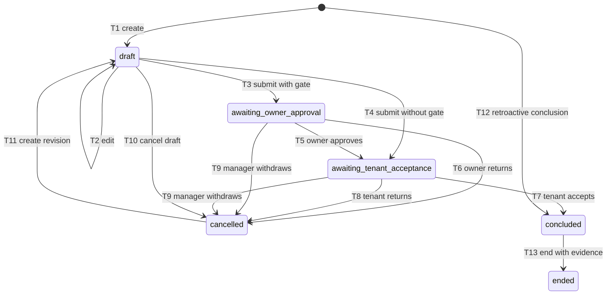

# @aqarak/domain

## 1. Responsibility

I keep the product's pure rules in this package. I perform no file, network,
database or device I/O here. I receive time, identifiers, authenticated actors
and authoritative record snapshots as arguments. I return a decision or a typed
refusal so that web, mobile, API and tests can share one implementation.

I treat a successful decision as proposed effects, not as proof of persistence.
I require the calling service to authorise the subject, load complete snapshots,
check concurrent versions and persist all effects in one transaction. I do not
claim that those database or API integrations exist merely because the pure
rules pass their tests.

## 2. Model

I organise the model into the following entity groups. In `src/entities`, I
define a strict, typed record for every stored entity in the core, parties,
estate, lease, money, maintenance, documents, work and AI groups. I infer the
TypeScript record types from their schemas. I keep audit event schemas and
chain rules in the separate `audit` module.

| Group       | Representation in this package                                                                                                                                                                               |
| ----------- | ------------------------------------------------------------------------------------------------------------------------------------------------------------------------------------------------------------ |
| Core        | Company, person account, membership, technician profile and invitation records, with shared outcomes and refusals.                                                                                           |
| Parties     | Owner, tenant, occupant and vendor records, with scoped permission facts; owner records permit bank details and tenant records reject them.                                                                  |
| Estate      | Property, unit, ownership, owner mandate and mandate-property link records, with unit transitions, availability and occupancy checks.                                                                        |
| Lease       | Contract, contract-unit link, version, version clause, template, clause, approval, Tawtheeq, discrepancy and handover records, with lifecycle and owner gate rules.                                          |
| Money       | Instalment, charge, allocation, payment, reversal, refund, cheque, deposit, invoice, invoice line, credit note, receipt, owner statement and payout records, with integer fils, VAT and financial decisions. |
| Maintenance | Ticket, quote and dispatch records, with cost approval routes, dispatch transitions and completion evidence.                                                                                                 |
| Documents   | Document metadata and version records, with immutable version snapshots, upload checks, independent processing and review states, validity and onboarding requirements.                                      |
| Work        | Note, task, reminder and notification records, with identifiers, vocabularies and reminder firing keys; their lifecycle transitions are not implemented.                                                     |
| AI          | Model call metadata, extraction, drafted action and entity version records, with read or draft co-worker families, base versions and field provenance.                                                       |
| Audit       | Strict event content, canonical encoding, hash chains, checkpoints and actor consistency.                                                                                                                    |

I use one concept and one name. I keep stored vocabulary values in `snake_case`;
document number series retain their specified uppercase codes, permission levels
retain their letter codes, and MIME types retain their standard spelling. I use
camelCase for record fields, while several decision snapshots in payments,
lifecycles and audit use snake_case. I require the API and database layers to map
between these representations explicitly; these mappings are integration
obligations, not implementations supplied by this package.
I distinguish the `documentValidity` schema from the `deriveDocumentValidity`
calculation.

## 3. Rules

**T1 to T13, IN8 and IN9.** I represent contract transitions as inspectable data
and apply their guards through `transitionContract`. T1 creates a draft; T2
edits a draft; T3 and T4 submit with or without the owner gate; T5 records owner
approval; T6 and T8 record a reasoned return; T7 accepts and concludes; T9
withdraws either submitted state; T10 cancels a draft; T11 creates a revision
linked to a cancelled predecessor; T12 records a retroactive conclusion; T13
ends a concluded contract with evidence. I show these transitions in Figure 1.
I refuse edits after submission. I cancel and revise instead, preserving the
submitted version and voiding its requested and approved approvals. I require
reasons on cancellation, return and withdrawal commands. For normal conclusion,
I bind the manager, gated owner and tenant approvals to one content hash and
require distinct people using their own sessions.

**R9, owner gate.** I first disable the gate for a self-managed owner company.
Otherwise I use the property override, then an applicable active mandate's
non-null setting, then the company default. I freeze that decision with the
content hash at submission so later policy changes cannot alter the approval
requirements for an already submitted version.

**IN8R, retroactive conclusion.** I require an accepted, clean registered
document with a number, date and matching linked identities. I require the
manager's confirmation to identify that document version and the same content
hash, and to supply provenance for every required extraction field. I also
require the named owner and tenant notification recipients. I return the
retroactive approval, registration, schedule and notification effects together.

**IN11 and IN12, Tawtheeq.** I model normal registration, reasoned skipping and
retroactive registration as three paths. I require owner confirmation to skip
when the frozen gate applies. I treat document comparison as evidence, not an
instruction to overwrite contract fields. I require a reasoned resolution for
each discrepancy and refuse identity substitution. My adoption exception
creates a new immutable `tawtheeq_adoption` version for a concluded contract;
material adopted changes require owner reapproval when the frozen gate applies.
I move the current version only after the complete approval set is valid and
return a tenant notification effect.

**C1 to C3, IN14 to IN17 and IN19, money.** I conserve payment credit as received
money less active allocations and refunds (C1). I prevent active allocations
from exceeding a debt's amount plus VAT and ignore reversed payments when
deriving coverage (C2). I derive invoice coverage from allocations and credit
notes and prevent credit above the remaining balance (C3). I require instalment
principal amounts to sum to the version total, with VAT checked separately per
line. I round VAT half up to the fils using integer arithmetic. My current tax
classification covers residential and commercial rent: commercial rent attracts
VAT only with a nonempty issuer TRN; I do not validate a TRN against an external
register. I refuse early cheque deposit and flag pending or received cheques at
six calendar months. If a cleared cheque bounces, I require reversal of its
payment, allocations and app receipt together. I issue at most one receipt per
payment. I plan gapless numbers per company and series; the database must lock
and commit the counter with the document. I reconcile an owner statement before
issuing it and locking its period.

**Charge status.** I retain the separate `chargeStatus` vocabulary. I derive
`settled` only when active recorded allocations cover principal plus VAT.
Partial coverage retains `open` or `invoiced`; explicit `waived` and `cancelled`
states remain explicit. I retain `unsettled_status` when recomputing an open or
invoiced charge so that voiding an allocation restores its earlier state. For an
imported settled charge without that history, I fall back to `open`; an importer
must supply `unsettled_status: "invoiced"` when that is the correct prior state.
Instalments retain their separate `open`, `partly_paid` and `paid` derivation.

**IN1 to IN3, permissions.** I represent role capabilities and approval steps
as data. I evaluate company isolation before role grants and return `NOT_FOUND`
for a missing or foreign-company subject. I require owner, tenant and technician
scope facts for their own records. I reject a second active staff membership
against the complete supplied membership snapshot. I leave race-free uniqueness
and authoritative scope loading to the database and API.

**IN4 to IN7, person confirmation.** I return refusals without a decision or
input mutation. I expose only read and draft effects to co-worker families.
I require the named person to commit a drafted action, and I expire a draft when
its base versions change. I require field provenance on committed payload
leaves and explicit document type and date confirmation. I keep pipeline
processing separate from human review and refuse pipeline business commits.
I require the service to authenticate these facts rather than trusting client
claims.

**IN10 and IN20, occupancy and maintenance.** I refuse overlapping blocking
contracts on the same units and derive occupancy from a concluded contract,
move-in and no move-out. I keep tickets on occupied units independent of unit
status. I require owner cost approval above the applicable threshold unless the
safety emergency rule applies. That rule requires an unsuccessful owner contact
attempt and compliance with any emergency limit, and returns owner notification
and charging obligations. I require completion evidence before work completion,
then cost allocation and tenant confirmation or an elapsed confirmation window
before closure. I leave technician assignment scope to permission checks.

**IN21, AQ-CANON-1 and the audit chain.** I sort ASCII identifier keys, preserve
array order, escape strings without Unicode normalisation, and encode numbers
as quoted shortest decimal text without exponent notation. I project event
timestamps to six fractional digits. Numeric `1` and string `"1"` encode
identically by design, so I require callers to validate field types before
encoding or request hashing. I hash each row from its previous hash, encoding
version and canonical text with SHA-256. I verify sequence continuity, row
content, links, the stored head and an independent anchor. A database superuser
can truncate events written after the last anchor and rewrite the stored head
without detection; I do not present the chain as protection against that case.
I treat the database as the production audit writer.

**IN13 and IN22, idempotency.** I derive request hashes from canonical path
parameters and body. I scope a client key by company, account and command type,
replay a completed matching request, refuse a changed request using the same
key, and retain completed replay eligibility through seven days. I build a
stable reminder key from rule, subject and caller-supplied Dubai local date.
I require database uniqueness for at-most-once firing. Notification delivery
deduplication and the WhatsApp link rule belong to notification work, which is
not implemented in this package.

### Invariant evidence

I use the following table to separate executable domain evidence from
integration obligations. References to database or API enforcement describe
required integration work, not a verified deployment. Test names below are in
`src/invariants.test.ts`.

| Id   | Rule                                                                                    | Where enforced                                                                                                                                                                     | Test name                                                                                                                         |
| ---- | --------------------------------------------------------------------------------------- | ---------------------------------------------------------------------------------------------------------------------------------------------------------------------------------- | --------------------------------------------------------------------------------------------------------------------------------- |
| IN1  | Nothing crosses companies.                                                              | `can`; API supplies scoped records and maps not found.                                                                                                                             | returns not found for another company's subject                                                                                   |
| IN2  | One active staff membership per person account.                                         | `transitionMembership`; database must enforce concurrent uniqueness.                                                                                                               | refuses a second active staff membership across companies                                                                         |
| IN3  | Parties and technicians reach only their scope.                                         | `can`; API loads trusted ownership, tenancy and assignment facts.                                                                                                                  | confines %s to its own subject scope                                                                                              |
| IN4  | Refusals change nothing.                                                                | Pure command outcomes; API must apply effects only on success.                                                                                                                     | returns no decision and leaves deeply frozen refused input unchanged                                                              |
| IN5  | Drafting cannot commit or approve on a person's behalf.                                 | Co-worker effect table and `transitionDraftedAction`; API authenticates the named person and commits atomically.                                                                   | allows only read or draft families and only the named person to commit                                                            |
| IN6  | Extracted fields require confirmation and provenance.                                   | Document review confirmation and drafted-action leaf provenance; API preserves these facts with saved values.                                                                      | requires confirmation and field provenance before accepting extracted values                                                      |
| IN7  | Pipeline actors cannot change human review or commit business state.                    | Document and drafted-action transitions; API separates pipeline credentials from person commands.                                                                                  | keeps pipeline processing separate from human review and business commit                                                          |
| IN8  | Normal conclusion requires one hash and distinct approvers.                             | Contract approval guards and frozen owner gate; API persists approval and conclusion effects together.                                                                             | requires distinct manager owner and tenant approvals on one hash                                                                  |
| IN8R | Retroactive conclusion requires registered evidence and manager confirmation.           | `transitionContract`; service records provenance and notification obligations atomically.                                                                                          | refuses retroactive conclusion without confirmed evidence                                                                         |
| IN9  | Submitted terms are immutable and cancellation voids approvals.                         | Contract transitions and reason checks; database must preserve immutable versions.                                                                                                 | refuses submitted edits and voids approvals on reasoned cancellation                                                              |
| IN10 | Blocking contracts do not overlap and handovers determine occupancy.                    | Contract overlap and `isOccupied`; database must prevent concurrent overlap and persist handovers.                                                                                 | blocks overlapping contracts and derives occupancy from handovers                                                                 |
| IN11 | Registration requires complete evidence, matching identity, resolutions and reapproval. | `validateRegistration`; API verifies the evidence source and commits the decision.                                                                                                 | requires registration document number date identity and approved resolutions                                                      |
| IN12 | Comparison cannot change fields without a reasoned resolution.                          | `resolveDiscrepancy` and immutable adoption decisions.                                                                                                                             | refuses comparison adoption without a reason and preserves source values                                                          |
| IN13 | At most one reminder firing per rule, subject and local date.                           | `firingDedupeKey` supplies identity; database unique constraint and transactional worker remain integration obligations.                                                           | assigns one firing key per rule subject and Dubai date                                                                            |
| IN14 | Schedule totals and line VAT reconcile; paid means covered.                             | Contract schedule validation and allocation coverage.                                                                                                                              | reconciles instalments and per-line VAT and derives paid only at full coverage                                                    |
| IN15 | No early cheque deposit; stale after six months.                                        | `transitionCheque` and `isChequeStale`.                                                                                                                                            | refuses early deposit and flags six calendar months                                                                               |
| IN16 | One receipt per payment and gapless company-series numbering.                           | Receipt snapshot checks and `takeNumber`; database must enforce receipt uniqueness and transactional counter locking.                                                              | issues one receipt and advances only the selected company series                                                                  |
| IN17 | VAT requires taxable rent and an issuer TRN.                                            | `applicableVatBp` and invoice validation; broader supply classification is not implemented.                                                                                        | applies VAT only to commercial rent with a nonempty issuer TRN                                                                    |
| IN18 | No tenant bank or IBAN field.                                                           | Strict `tenantRecord` has no bank or IBAN field and rejects unknown keys, together with the strict tenant invitation boundary; `ownerRecord` retains permitted owner bank details. | rejects bank and IBAN fields on the stored tenant record; rejects bank and IBAN fields on the existing tenant invitation boundary |
| IN19 | Owner statements reconcile.                                                             | Statement issue guard; database must enforce the returned period lock.                                                                                                             | refuses an unreconciled statement before issue and period locking                                                                 |
| IN20 | Cost authority precedes dispatch; closure needs completion and allocated cost.          | Ticket cost and completion guards; API verifies assignment and evidence.                                                                                                           | requires cost approval or the emergency rule and completion before closure                                                        |
| IN21 | Audit content, sequence, links and checkpoints verify.                                  | `verifyChain`; database writer and independent anchoring remain integration obligations.                                                                                           | verifies the chain and detects content sequence link head and anchor tampering                                                    |
| IN22 | Notification dedupe identity is stable.                                                 | Shared reminder firing-key function is tested; notification delivery deduplication and WhatsApp link rule are not yet implemented here.                                            | keeps the shared reminder notification identity stable across object ordering                                                     |

## 4. Contract lifecycle

I use the six stored contract states in Figure 1. I use the initial marker for
creation and retroactive conclusion; T11 creates a successor draft rather than
editing the cancelled record.

_Figure 1. I represent the T1 to T13 contract lifecycle using its stored states._

## 5. Public API

Every public domain symbol is exported through `@aqarak/domain`. I expose the
following modules through the package entry.

| Module        | Public responsibility                                                               |
| ------------- | ----------------------------------------------------------------------------------- |
| `result`      | I return typed success or refusal outcomes.                                         |
| `errors`      | I share core refusal codes, reasons and expected-version checks.                    |
| `ids`         | I validate branded canonical identifiers for record references.                     |
| `money`       | I calculate exact fils, bounded sums and per-line VAT.                              |
| `time`        | I validate dates and instants and perform Dubai calendar arithmetic.                |
| `vocabulary`  | I define closed stored statuses, kinds, roles and other enum lists.                 |
| `entities`    | I validate strict stored entity records and expose their inferred TypeScript types. |
| `audit`       | I encode, hash, append and verify audit data and actor consistency.                 |
| `contract`    | I apply T1 to T13, schedule, approval and overlap rules.                            |
| `documents`   | I check uploads, processing, review, validity and onboarding evidence.              |
| `idempotency` | I hash requests, decide replay and derive reminder firing identities.               |
| `lifecycles`  | I transition memberships, invitations and attributed drafted actions.               |
| `maintenance` | I apply ticket, cost authority, deadline, rating, quote and dispatch rules.         |
| `owner-gate`  | I resolve submission-time approval precedence.                                      |
| `payments`    | I record financial decisions, conservation, instruments and numbered documents.     |
| `permissions` | I evaluate role capabilities, subject scope and read or draft tool families.        |
| `tawtheeq`    | I validate registration evidence, discrepancy resolutions and adoption.             |
| `units`       | I apply unit lifecycle rules and derive occupancy.                                  |

I obtain presentation labels separately from `@aqarak/i18n` through
`getDomainLabels(locale)` and `domainLabel(locale, vocabularyName, value)`.
I constrain the lookup to each exported vocabulary's own values and expose
refusal messages in the catalogue's `errors` map.

## 6. Testing

I run `pnpm --filter @aqarak/domain test` from the repository root. On a
constrained machine I append `--maxWorkers=2`. I retain the per-file coverage
gate of 90 percent for lines and branches. I use fixed-seed property tests for
money conservation, canonical decimals, command sequences, scope, provenance
and workflow behaviour where those properties are implemented. I cap every
configured property at 100 runs.

I exercise every module through `src/index.test.ts` and the cross-module
invariants through `src/invariants.test.ts`. I keep complete catalogue checks
in `packages/i18n/src/domain-labels.test.ts`, discovering every exported Zod
enum so that new vocabulary requires labels in both languages.

I keep `fixtures/audit/canon-v1.json` as the shared AQ-CANON-1 contract that the
database implementation must also pass. I retain raw JSON text in
`input_json`, including `1.50`, so formatting cannot erase the decimal
spelling before parsing. I compare parsed inputs with explicit expected text
and retain independent event hash fixtures. I test tampering and also record
the undetectable unanchored-tail truncation limitation rather than treating it
as a successful tamper-detection case.
